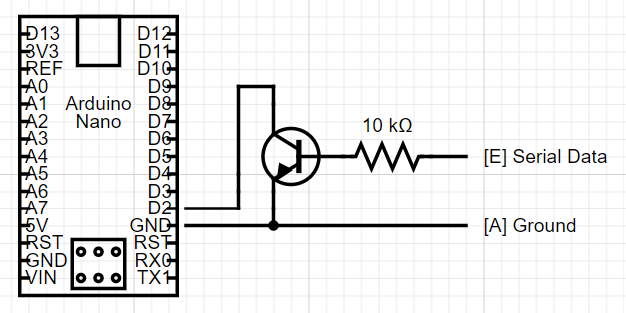

# aldl160-arduino
Arduino work on reading ALDL 160 baud data
A resource I found useful for exploring more about ALDL: https://www.techedge.com.au/vehicle/aldl160/aldl_sw.htm

HARDWARE
--------

Arduino NANO, NPN transaitor, 10k resistor

 - Digital pin 2 connected to collector of transistor (configured with internal pullup resistor)
 - Base of transitor connect to ALDL port E with a resistor in series
 - Ground connected to Emiter of transistor, ALDL port A, and ground of the Arduino. 
 
 - Optionally add an I2C header connected to 5V, GDN, A4 & A5 to attach a display.
 
SOFTWARE
--------
 Quick summary:
 - Attach an interrupt to pin 2 on change
 - If LOW (inverted by transitor) then note millis
 - If HIGH, compare duration between change.   < 2000us = 0; >2000us = 1 
 - Assemble bits into 9 bit bytes.
 - 0x1FF (9 1s in a row) is the sync character
 - Data until next sync is messages in format 0x0XX where XX is a data message per the ECM spec
 
DECODING ECM MESSAGES
---------------------
IN PROGRESS

HISTORY
-------
I have a 1990 GMC with a 5V 160 baud ALDL diagnostics port.   After receiving a "service engine" light I set out the path of building a USB cable and using WinALDL (https://winaldl.joby.se/) to diagnose what was going on. (Code 32, EGR, had to replace a solenoid).   After exploring the data in WinALDL I realized RPM and speed was reported by the ECM and I thought that would be useful display.  I have a bunch of Arduinos and ESP32s kicking around and several 1602 and OLED displays....   I figured I must be able to connect a ucontroller to the data pin and extract that data on a display in near real-time.

ACKNOWLEDGEMENTS
----------------
I studied lots of source code repos and websites for inspiration:
- https://www.bot-thoughts.com/2018/01/decoding-gms-aldl-with-teensy-36.html
- https://www.techedge.com.au/vehicle/aldl160/aldl_sw.htm
- https://github.com/rchipka/Arduino-ALDL-160-baud
- https://github.com/MikeEckels/OBD1Scanner/tree/master/OBD1Scanner
- https://github.com/MikeEckels/OBD1Scanner/blob/master/OBD1Scanner/DataStreamDefs.h
- https://github.com/shimniok/ALDL160_logger
- https://winaldl.joby.se/aldlcable.htm

